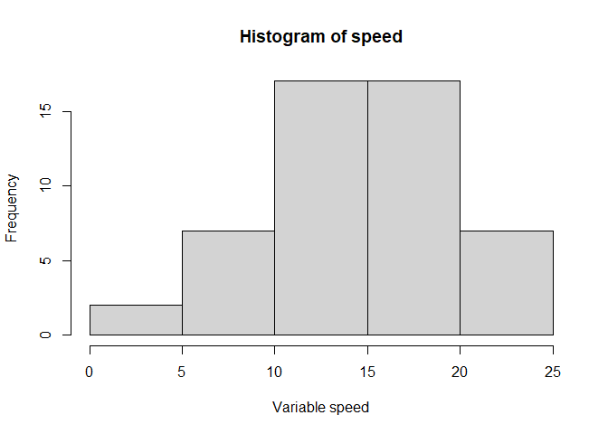

<!-- README.md is generated from README.Rmd. Please edit that file -->

# Rfinal

<!-- badges: start -->
<!-- badges: end -->

The goal of Rfinal is to make data analysis easier.

## Installation

You can install the development version of Rfinal like so:

``` r
devtools::install_github(“LLJuly/Rfinal”)
```

## Example

This is a basic example which shows you how to use Rfinal to get a
histogram:

``` r
library(Rfinal)
get_histogram_final(cars, "speed")
```



    #> $breaks
    #> [1]  0  5 10 15 20 25
    #> 
    #> $counts
    #> [1]  2  7 17 17  7
    #> 
    #> $density
    #> [1] 0.008 0.028 0.068 0.068 0.028
    #> 
    #> $mids
    #> [1]  2.5  7.5 12.5 17.5 22.5
    #> 
    #> $xname
    #> [1] "df[, col]"
    #> 
    #> $equidist
    #> [1] TRUE
    #> 
    #> attr(,"class")
    #> [1] "histogram"
